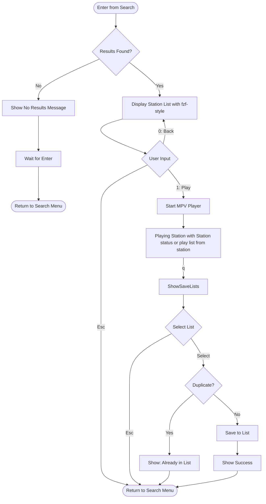
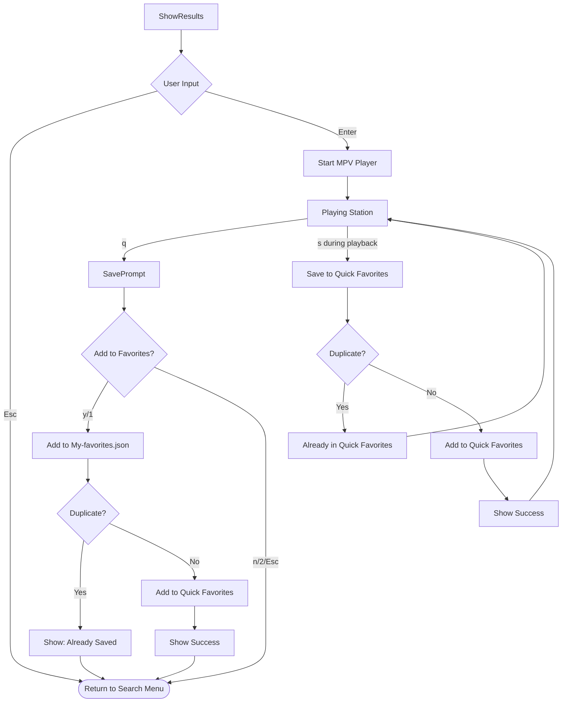

# Flow Chart vs Code Alignment Analysis - Search Results Screen

## Current Flow Chart (Updated)



## Current Code Implementation

```text
ShowResults (fzf-style list)
    ↓ (Enter key)
Playing Station
    ↓ (q key)
Save Prompt (Quick Favorites only)
    ↓ (y/1 or n/2)
Back to Search Results
```

## Misalignments

### 1. ❌ Input Keys Don't Match

**Flow Chart:**
- `Esc` → Back to Search Menu
- `0: Back` → ShowResults (unclear what this means)
- `1: Play` → Start playing

**Current Code:**
- `Esc` → Back to Search Menu ✅
- `Enter` → Start playing (not `1`)
- No `0` or numbered options in results list

**Issue:** The flow chart suggests numbered menu options (0, 1) but current code uses standard list navigation with Enter.

---

### 2. ❌ Save Functionality Completely Different

**Flow Chart:**
- After stopping playback (`q`), show list selection menu
- User selects which list to save to (any list, not just Quick Favorites)
- Can save to any favorite list

**Current Code:**
- After stopping playback (`q`), show simple yes/no prompt
- Only option is "Add to Quick Favorites" (My-favorites.json)
- Cannot choose different lists

**Code:**
```go
func (m SearchModel) renderSavePrompt() string {
    // ...
    s.WriteString("1) ⭐ Add to Quick Favorites\n")
    s.WriteString("2) Return to search results\n\n")
    // No option to select different lists!
}
```

---

### 3. ❌ Missing States/Functionality

**Flow Chart Requires:**
- State: `searchStateListSelection` (choosing which list to save to)
- UI: List selection menu showing all available favorite lists
- Logic: Save to selected list (not just My-favorites.json)

**Current Code Has:**
- State: `searchStateSavePrompt` (simple yes/no)
- UI: Binary choice prompt
- Logic: Only saves to My-favorites.json

---

## Required Changes to Align with Flow Chart

### Option A: Change Code to Match Flow Chart (More Work)

Would need to add:

1. **New state:** `searchStateListSelection`
2. **Load available lists** (like Play screen does)
3. **List selection UI** 
4. **Save to selected list** functionality
5. Handle all edge cases (empty lists, duplicates across lists, etc.)

**Files to modify:**
- `internal/ui/search.go` - Add state, load lists, create list menu
- Add list selection after playback stops
- Modify save logic to work with any list

### Option B: Update Flow Chart to Match Code (Simpler)

Update flow chart to reflect current behavior:



---

## Recommendation

I recommend **Option B** - update the flow chart to match current code because:

1. ✅ Current code works well - simple, clear UX
2. ✅ "Quick Favorites" is the most common use case
3. ✅ Users can always use Play Screen to save to other lists
4. ✅ Consistent with spec: "NEW discovered stations → Quick Favorites"
5. ✅ Less complex implementation
6. ✅ No breaking changes needed

If you need the ability to save search results to ANY list (not just Quick Favorites), then we should implement Option A. But this would be a significant feature addition.

---

## Questions for Clarification

1. **Should search results allow saving to any list, or just Quick Favorites?**
   - Current: Quick Favorites only
   - Flow chart suggests: Any list

2. **Should the results list use numbered options (1: Play) or standard Enter key?**
   - Current: Enter key (standard list behavior)
   - Flow chart suggests: Numbered option "1: Play"

3. **What does "0: Back → ShowResults" mean in the flow chart?**
   - It already loops back to ResultInput
   - Is this redundant or does it mean something specific?

---

## Summary

**Main Discrepancy:** Flow chart shows saving to ANY list after playback, current code only saves to Quick Favorites.

**Recommendation:** Update flow chart to match current simpler implementation, OR implement full list selection if that's the desired UX.
