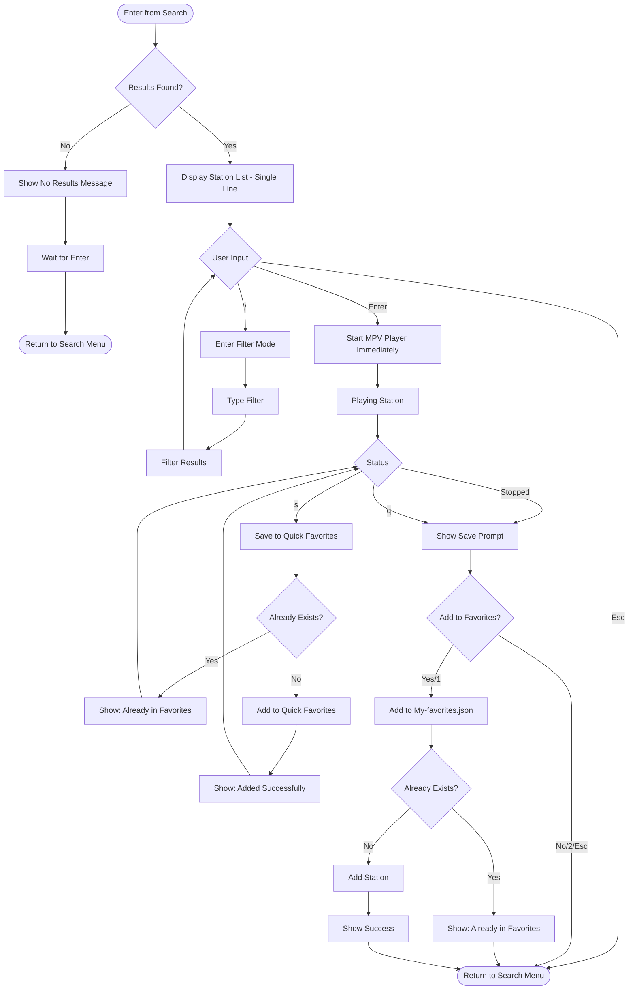

## 4. Search Results Screen (UPDATED)

**State:**
- `results []Station` - Search results from API
- `filteredResults []Station` - After filter applied
- `selectedStation *Station` - Currently selected
- `filterText string` - Current filter

**UI Design:**
- **Search results**: fzf-style display (many results, often 100s-1000s)
- **Single line display**: Format: `NAME • COUNTRY • CODEC BITRATE`
  - Example: `SMOOTH JAZZ • United States • MP3 128kbps`
- Instant filtering with '/' key
- **Direct play on Enter** - No submenu

**Key Logic:**
- Stations displayed in compact single-line format
- **Direct play on Enter** - Immediately starts playback, no intermediate menu
- Check for duplicates by StationUUID
- **Save prompt after playback** - these are NEW discovered stations
- Can also save during playback with 's' key
- Multiple navigation options (Esc to go back)

**Changes from Original:**
- ❌ Removed: Station info submenu (options 1-3)
- ❌ Removed: `i` key for quick info preview
- ✅ Added: Direct play on Enter
- ✅ Changed: Single-line station display
- ✅ Kept: Filter with '/' key
- ✅ Kept: Save to Quick Favorites during/after playback
