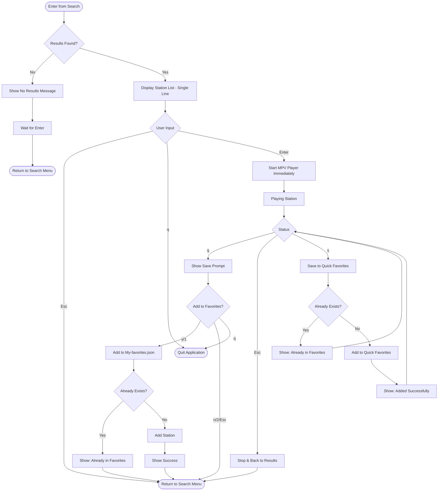
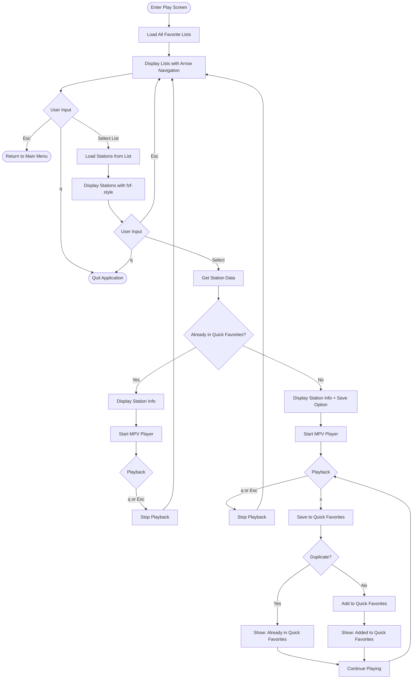
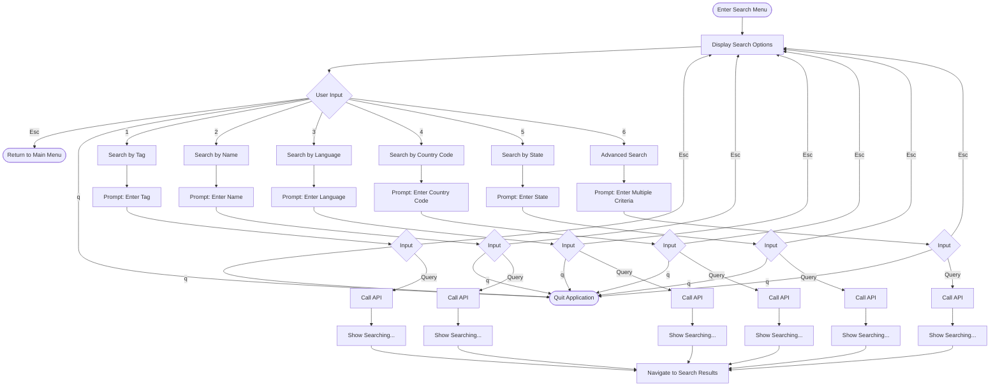

# Updated Flow Charts - Keyboard Shortcuts Standardization

## Key Changes Throughout All Flow Charts

### Global Changes
- **Removed:** `0` (back), `00` (main menu)
- **Standardized:** `Esc` (back), `q` (quit)

---

## 4. Search Results Screen (UPDATED)



**Key Updates:**
- Added `q` → Quit from results list
- Added `q` → Quit from save prompt
- Separated `q` and `Esc` behavior during playback:
  - `q` - Shows save prompt
  - `Esc` - Goes back without prompt
- Removed all `0` and `00` references

---

## 2. Play Screen (UPDATED)



**Key Updates:**
- Changed `Esc/0` → `Esc` for back
- Added `q` for quit at each level
- Removed `0` shortcuts
- Combined `q/esc/0` → `q or Esc` in playing state

---

## 3. Search Menu Screen (UPDATED)



**Key Updates:**
- Changed `0` → `Esc` for back to menu
- Changed `00` → `q` for quit
- Added `q` → Quit at menu level
- Removed all `0` and `00` references

---

## Summary of Flow Chart Updates

### Every Flow Chart Needs:
1. Replace `0` with `Esc` for "back one level"
2. Replace `00` with `q` for "quit application"  
3. Add `q` option at every interactive state
4. Remove `0/Esc` combined options → just `Esc`
5. Update help text in all states

### Standard Navigation Pattern:
```text
Any Screen
├── Esc → Back one level
├── q → Quit application
└── Ctrl+C → Force quit
```

This provides consistent, industry-standard navigation throughout the entire application.
