# TERA Screen Flow Charts


## Application Overview


**Note:** QuickPlay stations are from My-favorites.json, so no save prompt after playback.

---

## 1. Main Menu Screen


**State:**
- `stations []Station` - Quick favorites (My-favorites.json)
- `menuItems []MenuItem` - Dynamic menu with favorites
- `config *Config` - App configuration

**Actions:**
- Load quick favorites on init
- Build dynamic menu items
- Handle numeric shortcuts (10-19)
- Navigate to selected screen
- **No save prompt after QuickPlay** - these stations are already in My-favorites.json

---

## 2. Play Screen

```mermaid
flowchart TD
    Enter([Enter Play Screen]) --> LoadLists[Load All Favorite Lists]
    LoadLists --> ShowLists[Display Lists with Arrow Navigation]
    
    ShowLists --> ListInput{User Input}
    ListInput -->|Esc/0| Back([Return to Main Menu])
    ListInput -->|Select List| LoadStations[Load Stations from List]
    
    LoadStations --> ShowStations[Display Stations with fzf-style]
    ShowStations --> StationInput{User Input}
    
    StationInput -->|Esc/0| ShowLists
    StationInput -->|/| Filter[Enter Filter Mode]
    StationInput -->|d| ConfirmDelete{Confirm Delete?}
    StationInput -->|i| InfoPreview[Show Info Overlay]
    StationInput -->|Select| GetStation[Get Station Data]
    
    Filter --> FilterInput[Type Filter Text]
    FilterInput --> UpdateList[Filter Station List]
    UpdateList --> StationInput
    
    ConfirmDelete -->|No/Esc| ShowStations
    ConfirmDelete -->|Yes| DeleteStation[Remove from List]
    DeleteStation --> SaveJSON[Save Updated JSON]
    SaveJSON --> DeleteSuccess[Show Success Message]
    DeleteSuccess --> CheckEmpty{List Empty?}
    CheckEmpty -->|Yes| ShowLists
    CheckEmpty -->|No| ShowStations
    
    InfoPreview -->|Esc/i| ShowStations
    
    GetStation --> CheckInQuick{Already in Quick Favorites?}
    CheckInQuick -->|Yes| ShowInfo1[Display Station Info]
    CheckInQuick -->|No| ShowInfo2[Display Station Info + Save Option]
    
    ShowInfo1 --> StartPlayer1[Start MPV Player]
    ShowInfo2 --> StartPlayer2[Start MPV Player]
    
    StartPlayer1 --> Playing1{Playback}
    StartPlayer2 --> Playing2{Playback}
    
    Playing1 -->|q| Stop1[Stop Playback]
    Playing1 -->|Error| Error1[Show Error Message]
    
    Playing2 -->|q| Stop2[Stop Playback]
    Playing2 -->|s| SaveToQuick[Save to Quick Favorites]
    Playing2 -->|Error| Error2[Show Error Message]
    
    Stop1 --> ShowLists
    Error1 --> ShowLists
    Stop2 --> ShowLists
    Error2 --> ShowLists
    
    SaveToQuick --> CheckDupe{Duplicate?}
    CheckDupe -->|Yes| AlreadyMsg[Show: Already in Quick Favorites]
    CheckDupe -->|No| DoSave[Add to Quick Favorites]
    AlreadyMsg --> Continue[Continue Playing]
    DoSave --> SuccessMsg[Show: Added to Quick Favorites]
    SuccessMsg --> Continue
    Continue --> Playing2
```



**State:**
- `lists []string` - Available favorite lists
- `selectedList string` - Currently selected list
- `stations []Station` - Stations in selected list
- `filterText string` - Current filter
- `player *MPVPlayer` - Player instance

**UI Design:**
- **Lists**: Simple arrow key navigation (few items, typically 3-10 lists)
- **Stations**: fzf-style with filter capability (moderate items, 10-100 stations)
  - Provides quick filtering even for smaller lists
  - Consistent user experience across the app
  - Stations sorted alphabetically (case-insensitive)

**Key Logic:**
- Check if station is already in Quick Favorites (My-favorites.json) by StationUUID
- If already in Quick Favorites: Don't show save option (no 's' key, no prompt after)
- If from another list: Allow saving to Quick Favorites during playback (press 's')
- Check for duplicates by StationUUID before adding
- **No save prompt after playback** - only during playback with 's' key
- If user presses 's' but station is already in Quick Favorites, show friendly message

**Rationale:**
- Stations from My-favorites.json → Already saved, no need to save again
- Stations from other lists → User might want to promote to Quick Favorites for main menu access
- Simple, clear UX without redundant prompts

---

## 3. Search Menu Screen


**State:**
- `searchType SearchType` - Tag, Name, Language, Country, State, Advanced
- `query string` - User's search query
- `loading bool` - API call in progress

**Actions:**
- POST to Radio Browser API
- Handle navigation shortcuts (0, 00)
- Display spinner during search
- Navigate to results on success

---

## 4. Search Results Screen


**State:**
- `results []Station` - Search results from API
- `filteredResults []Station` - After filter applied
- `selectedStation *Station` - Currently selected
- `filterText string` - Current filter

**UI Design:**
- **Search results**: fzf-style display (many results, often 100s-1000s)

**Key Logic:**
- Check for duplicates by StationUUID
- **Save prompt after playback** - these are NEW discovered stations
- Multiple navigation options (0, 00, Esc)
- Two save paths:
  1. Play then auto-prompt for Quick Favorites
  2. Save to any list without playing

---

## 5. List Management Menu Screen


**State:**
- `lists []string` - Available lists
- `operation Operation` - Create, Delete, Edit, ShowAll
- `inputValue string` - User input

**Validation Rules:**
- List names cannot be empty
- Names must be unique
- "My-favorites" is protected (cannot delete/rename)
- Replace spaces with hyphens in names

---

## 6. Lucky Screen (I Feel Lucky)


**State:**
- `station *Station` - Random station selected
- `player *MPVPlayer` - Player instance

**Logic:**
- Query API for high-vote stations
- Select random from results
- **Save prompt after playback** (NEW discovery)
- Can also save during playback with 's' key
- Duplicate checking for both save methods

---

## 7. Gist Menu Screen


**State:**
- `hasToken bool` - Token configured status
- `gistCount int` - Number of saved gists
- `currentToken string` - Masked token display

---

## 8. Create Gist Screen


**State:**
- `token string` - GitHub token
- `files []FavoritesList` - Files to upload
- `gistID string` - Created gist ID
- `gistURL string` - Created gist URL

**Actions:**
- Read all JSON files from favorite path
- Build GitHub gist payload
- Save gist metadata for tracking
- Handle errors with helpful messages

---

## 9. My Gists Screen

```mermaid
flowchart TD
    Enter([Enter My Gists]) --> LoadMetadata[Load Local Gist Metadata]
    LoadMetadata --> CheckCount{Gists Available?}
    
    CheckCount -->|No| NoGists[Show: No Gists Created]
    NoGists --> Suggest[Suggest: Create First Gist]
    Suggest --> Back1([Return to Gist Menu])
    
    CheckCount -->|Yes| ShowList[Display Gist List]
    ShowList --> ListFormat[Format: Description | Created Date]
    ListFormat --> UserInput{User Input}
    
    UserInput -->|0/Esc| Back2([Return to Gist Menu])
    UserInput -->|Select Number| GetGist[Get Selected Gist]
    
    GetGist --> OpenURL[Open Gist URL in Browser]
    OpenURL --> Wait[Wait for Enter]
    Wait --> ShowList
```

**State:**
- `gists []GistMetadata` - Local gist records
- `selectedGist *GistMetadata` - User selection

**Display:**
- Index | Description | Created Date
- Up to 10 gists per page

---

## 10. Token Management Screen


**State:**
- `token string` - Current token
- `maskedToken string` - Display version
- `username string` - GitHub username
- `valid bool` - Validation status

**Security:**
- Hidden input when typing token
- Mask all displays (show first 11 + last 4)
- Store in keyring (fallback to encrypted file)
- Clear from memory after operations

---

## 11. Update Gist Screen


**State:**
- `gists []GistMetadata` - Available gists
- `selectedGist *GistMetadata` - Gist to update
- `newDescription string` - New description

**Actions:**
- PATCH request to update description only
- Update local metadata file
- Keep other gist data unchanged

---

## 12. Delete Gist Screen


**State:**
- `gists []GistMetadata` - Available gists
- `selectedGist *GistMetadata` - Gist to delete
- `confirmed bool` - User confirmation

**Safety:**
- Requires explicit "yes" confirmation
- Shows gist details before delete
- Removes local metadata even on API error
- Handles 404 gracefully (already deleted)

---

## 13. Recover from Gist Screen

```mermaid
flowchart TD
    Enter([Enter Recover]) --> CheckLocal{Local Gists Exist?}
