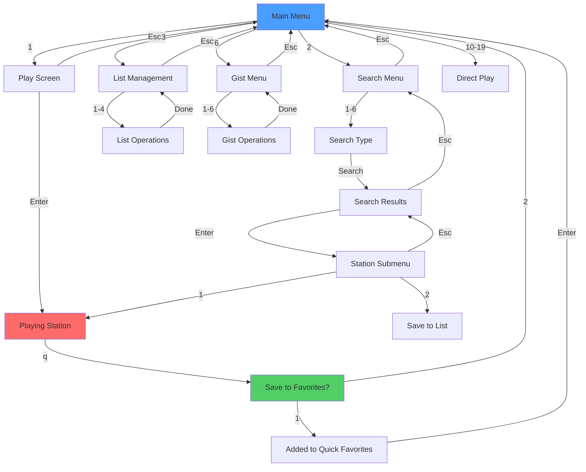

# TERA Go Keyboard Shortcuts Guide

This document outlines the keyboard navigation system for TERA Go, designed to provide fast, intuitive control across all screens.

---

## Design Philosophy

TERA's keyboard shortcuts follow these principles:

1. **Vim-like navigation** - Use `j`/`k` or arrow keys for vertical movement
2. **Consistency** - Same keys work the same way across all screens
3. **Discoverability** - Help (`?`) available on every screen
4. **Safety** - Destructive actions require confirmation
5. **Efficiency** - Quick actions for common workflows

---

## Global Navigation Keys

These keys work consistently across all screens:

### Movement
- **↑ / k** — Move cursor up
- **↓ / j** — Move cursor down
- **Home / g** — Jump to first item
- **End / G** — Jump to last item
- **PgUp / Ctrl+u** — Scroll page up
- **PgDn / Ctrl+d** — Scroll page down

### Actions
- **Enter** — Select current item / Confirm action
- **Esc / q** — Go back / Cancel
- **Ctrl+C** — Quit application immediately

### Utility
- **?** — Show help for current screen
- **/** — Filter/search current list
- **i** — Show detailed info (context-dependent)

---

## Main Menu Shortcuts

From the main menu, these number keys provide quick access:

### Core Features
- **1** — Play from My List
- **2** — Search Radio Stations
- **3** — List Management (CRUD)
- **4** — Delete a Station
- **5** — I Feel Lucky (random station)
- **6** — Gist Backup/Restore
- **0 / q** — Exit TERA

### Quick Play (Dynamic Section)
If you have stations saved in "My Favorites":
- **10-19** — Play favorite station directly (shortcuts 10-19 for first 10 favorites)

**Example Main Menu:**
```
TERA MAIN MENU

1) Play from my list
2) Search radio stations
3) List (Create/Read/Update/Delete)
4) Delete a radio station
5) I feel lucky
6) Gist
0) Exit

--- Quick Play Favorites ---
10) ▶ Jazz FM
11) ▶ BBC Radio 1
12) ▶ Classical KDFC
```

---

## Play Screen Shortcuts

**Context:** Browsing and playing stations from your saved lists

### Navigation
- **↑↓ / jk** — Move through station list
- **/** — Filter stations by name
- **Enter** — Play selected station
- **Esc / q** — Return to main menu

### Actions While Playing
- **Space** — Pause/Resume (if mpv supports)
- **s** — Save current station to Quick Favorites
- **i** — Show detailed station information
- **q** — Stop playback and return

---

## Search Screen Shortcuts

**Context:** Searching for new radio stations

### Search Menu
- **1** — Search by Tag (genre, style)
- **2** — Search by Name
- **3** — Search by Language
- **4** — Search by Country Code
- **5** — Search by State
- **6** — Advanced Search (multiple criteria)
- **0 / Esc** — Back to main menu

### Search Results
- **↑↓ / jk** — Browse results
- **Enter** — Show station submenu
- **/** — Filter current results
- **i** — Quick info preview
- **Esc** — Back to search menu

### Station Submenu (After selecting a station)
- **1** — Play station
- **2** — Save to list
- **3** — Back to search results
- **0** — Back to main menu

---

## List Management Shortcuts

**Context:** Creating and managing favorite lists

### List Menu
- **1** — Create a new list
- **2** — Delete a list
- **3** — Edit list name
- **4** — Show all lists
- **0 / Esc** — Back to main menu

### Creating/Editing
- **Type text** — Enter list name
- **Enter** — Confirm
- **Esc** — Cancel
- **0** — Quick return to main menu
- **00** — Quick return to list menu

---

## Gist Integration Shortcuts

**Context:** Backing up and restoring favorites via GitHub Gist

### Gist Menu
- **1** — Create a new gist (backup all lists)
- **2** — My Gists (view saved gists)
- **3** — Recover favorites from gist
- **4** — Update a gist
- **5** — Delete a gist
- **6** — Token Management (setup GitHub access)
- **0 / Esc** — Back to main menu

### Token Management
- **1** — Setup/Change Token
- **2** — View Current Token (masked)
- **3** — Validate Token
- **4** — Delete Token
- **0 / Esc** — Back to gist menu

---

## Station Information Screen

**Context:** Viewing detailed information about a station

Shows:
- **NAME:** Station name
- **TAGS:** Genre/categories
- **COUNTRY:** Broadcasting country
- **VOTES:** Popularity score
- **CODEC:** Audio format (MP3, AAC, OGG, etc.)
- **BITRATE:** Stream quality (kbps)

### Actions
- **Enter** — Return to previous screen
- **p** — Play this station
- **s** — Save to favorites
- **Esc / q** — Go back

---

## Advanced Navigation Patterns

### Quick Navigation Shortcuts
Throughout the app, you can use these patterns for fast navigation:

- **Type "0"** — Return to previous screen
- **Type "00"** — Return to main menu (works from most screens)
- **Type "back"** — Explicit back command
- **Type "main"** — Explicit main menu command

These work in text input prompts for convenient navigation.

### Filtering/Search Within Lists
When viewing any list (stations, search results, etc.):

1. Press **/** to activate filter mode
2. Type search term
3. List filters in real-time
4. Press **Enter** to select filtered item
5. Press **Esc** to clear filter

---

## Context-Specific Shortcuts

### While Station is Playing

The behavior depends on screen:

**Play Screen:**
- **q** — Stop playback and return to list
- **s** — Add to Quick Favorites (if not already added)
- **↑↓** — Browse other stations (playback continues)

**After Playback Ends:**
TERA shows a prompt:
```
Did you enjoy this station?

Station: Jazz FM
From list: My Jazz Collection

1) ⭐ Add to Quick Play Favorites
2) Return to Main Menu
```

Use **1** or **2** to choose.

---

## Help System

### Accessing Help
Press **?** on any screen to see context-specific help.

Help screens show:
- Available keys for current screen
- Description of what each key does
- Navigation tips
- Shortcuts specific to the current context

### Help Screen Navigation
- **↑↓ / jk** — Scroll help text
- **Esc / q** — Close help and return

---

## Keyboard Shortcuts Cheat Sheet

Quick reference table:

| Key | Global Action | Screen-Specific |
|-----|---------------|-----------------|
| **↑↓ / jk** | Navigate up/down | Works everywhere |
| **Enter** | Select/Confirm | Contextual |
| **Esc / q** | Back/Cancel | Previous screen |
| **Ctrl+C** | Quit immediately | Force exit |
| **?** | Help | Context help |
| **/** | Filter/Search | Within current list |
| **i** | Info | Station details |
| **0** | Previous menu | Quick back |
| **00** | Main menu | From anywhere |
| **1-6** | Main menu items | Quick access |
| **10-19** | Quick favorites | Direct play |
| **g / Home** | First item | Jump to top |
| **G / End** | Last item | Jump to bottom |
| **s** | Save | Add to favorites |
| **p** | Play | Play station |

---

## Keyboard Navigation Flowchart



---

## Tips for Efficient Use

### 1. Master Quick Navigation
- Learn the **0** (back) and **00** (main) patterns
- Use **/** to quickly filter large lists
- Use **10-19** for instant playback of favorites

### 2. Search Efficiently
- Start with **Tag** search for broad discovery
- Use **Name** search when you know what you want
- Try **Advanced Search** for precise criteria

### 3. Organize Your Stations
- Create themed lists (Jazz, Rock, News, etc.)
- Add best stations to Quick Favorites for instant access
- Use descriptive list names for easy finding

### 4. Backup with Gist
- Regularly backup to Gist (option 6 → 1)
- Store your GitHub token securely (option 6 → 6)
- Lists are recoverable from any device

### 5. Station Discovery
- Use **I Feel Lucky** (option 5) to discover new stations
- Check **VOTES** and **BITRATE** for quality indicators
- Explore different **TAGS** for variety

---

## Accessibility Features

### Visual Feedback
- Selected items are highlighted
- Current screen is clearly labeled
- Loading states show spinners
- Errors are displayed in contrasting colors

### Keyboard-Only Operation
- No mouse required
- Every action has a keyboard shortcut
- Clear visual cursor for current position

### Clear Error Messages
When something goes wrong, TERA shows:
- **What happened** (clear error message)
- **Why it happened** (common causes)
- **How to fix it** (next steps)

Example:
```
✗ Failed to create gist!

Error: Bad credentials

Common issues:
1. Verify the token has 'gist' scope
2. Make sure you have internet connection
3. Token might be expired - generate a new one
4. Update token via: Gist Menu → Token Management → Setup Token

Press Enter to return to menu...
```

---

## Platform-Specific Notes

### macOS
- All shortcuts work as documented
- **Cmd+C** also quits (in addition to Ctrl+C)
- **Cmd+Q** quits (standard macOS behavior)

### Linux
- All shortcuts work as documented
- Terminal emulator shortcuts may take precedence
- If a key doesn't work, check terminal settings

### Windows
- All shortcuts work in most terminals
- Windows Terminal recommended for best experience
- Some terminals may require configuration

---

## Customization (Future)

In future versions, TERA may support:
- Custom key bindings
- Vi vs Emacs style navigation
- Color schemes
- Macro recording

---

## Summary

TERA's keyboard shortcuts are designed to be:
- **Learnable** — Logical patterns, not arbitrary
- **Memorable** — Consistent across screens
- **Efficient** — Quick access to common actions
- **Forgiving** — Esc/back always available
- **Discoverable** — Help (?) on every screen

**Most important shortcuts to learn:**
1. **↑↓ / jk** — Navigation
2. **Enter** — Select/Confirm  
3. **Esc / q** — Back/Cancel
4. **?** — Help
5. **/** — Filter
6. **0/00** — Quick navigation

Master these, and you'll be navigating TERA like a pro! 🎵
