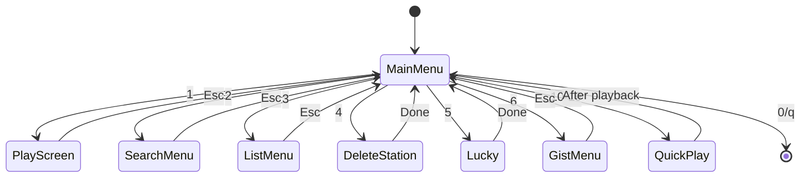
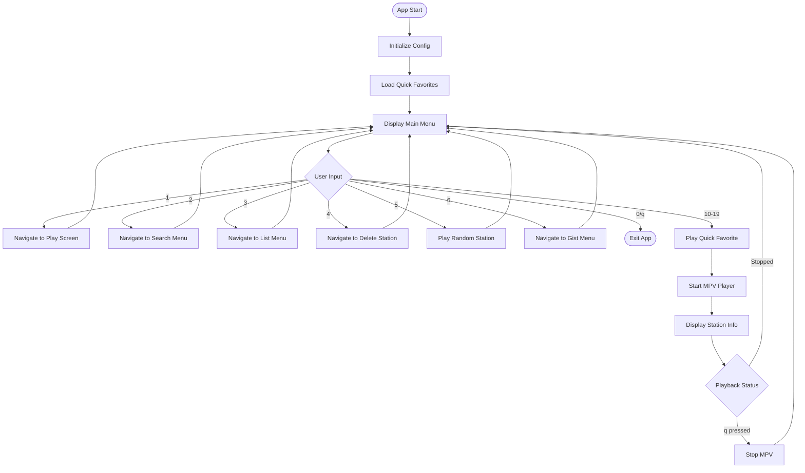
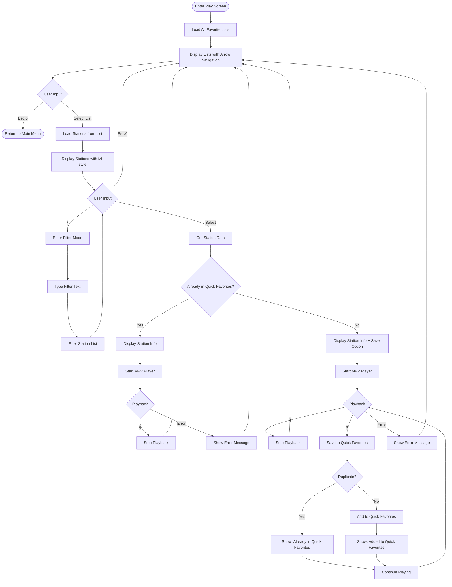
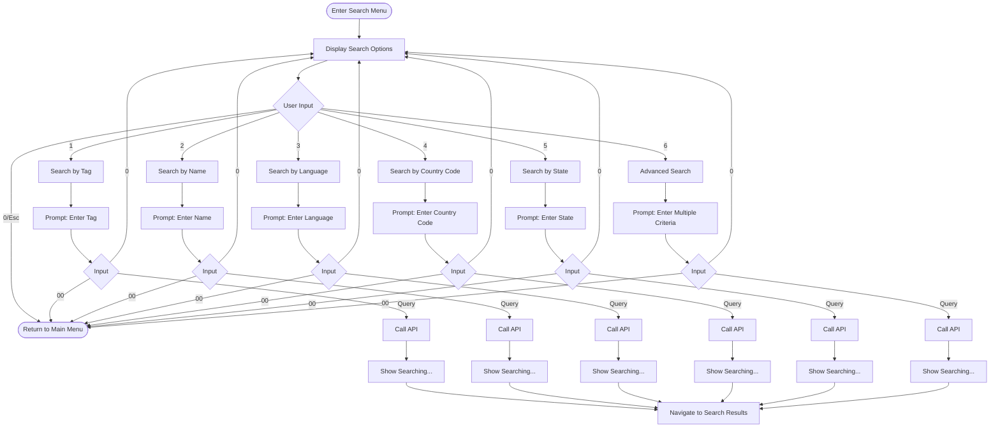
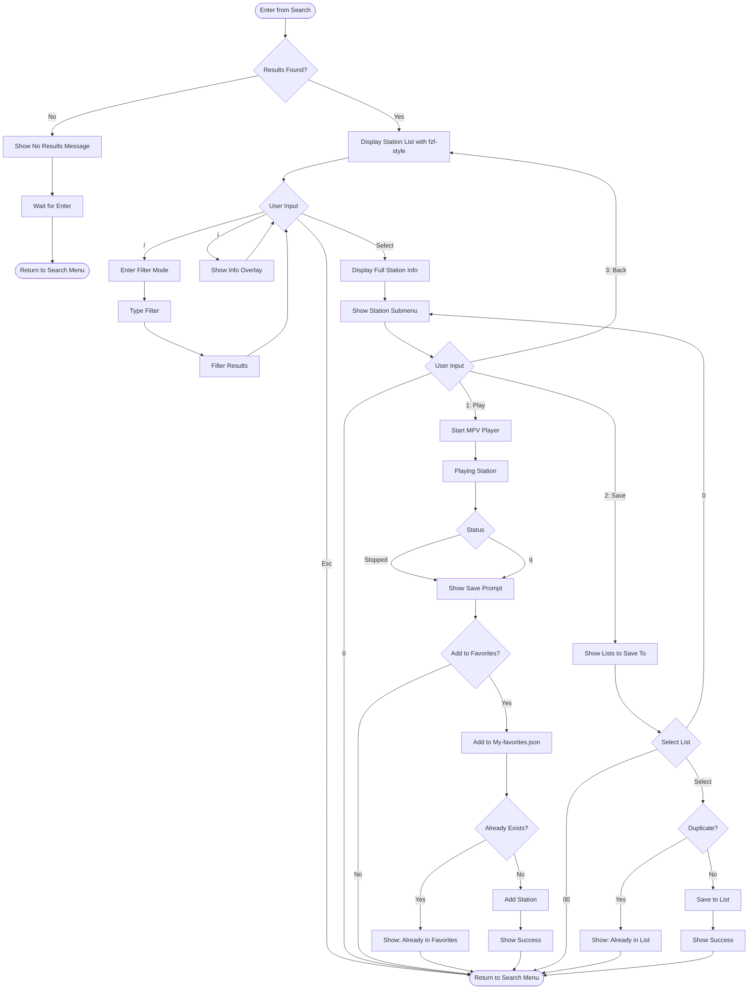
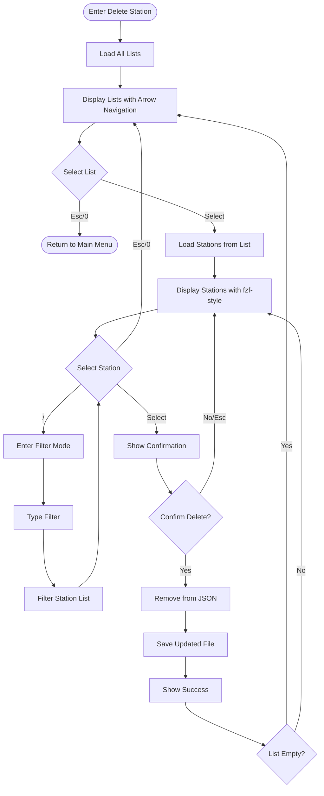
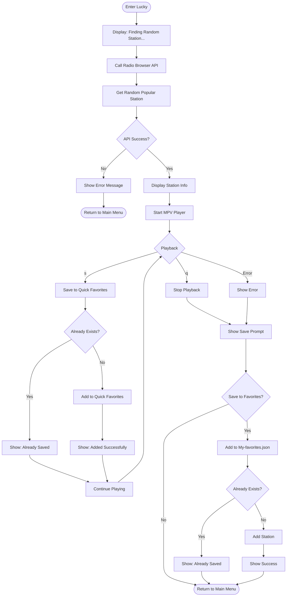

# TERA Screen Flow Charts - Updated

## Summary of Changes
1. **Application Overview & Main Menu**: Removed save prompt after QuickPlay (stations already in My-favorites.json)
2. **Play Screen**: 
   - Context-aware save behavior based on whether station is already in Quick Favorites
   - Use simple arrow navigation for lists, fzf-style for stations
   - Only allow 's' key save during playback if not already in Quick Favorites
3. **UI Display Strategy**: 
   - Lists (few items): Simple arrow navigation
   - Stations & Search Results (many items): fzf-style with filtering

---

## Application Overview

**Note:** QuickPlay stations are from My-favorites.json, so no save prompt after playback.

---

## 1. Main Menu Screen

**State:**
- `stations []Station` - Quick favorites (My-favorites.json)
- `menuItems []MenuItem` - Dynamic menu with favorites
- `config *Config` - App configuration

**Actions:**
- Load quick favorites on init
- Build dynamic menu items
- Handle numeric shortcuts (10-19)
- Navigate to selected screen
- **No save prompt after QuickPlay** - these stations are already in My-favorites.json

---

## 2. Play Screen

**State:**
- `lists []string` - Available favorite lists
- `selectedList string` - Currently selected list
- `stations []Station` - Stations in selected list
- `filterText string` - Current filter
- `player *MPVPlayer` - Player instance

**UI Design:**
- **Lists**: Simple arrow key navigation (few items, typically 3-10 lists)
- **Stations**: fzf-style with filter capability (moderate items, 10-100 stations)
  - Provides quick filtering even for smaller lists
  - Consistent user experience across the app
  - Stations sorted alphabetically (case-insensitive)

**Key Logic:**
- Check if station is already in Quick Favorites (My-favorites.json) by StationUUID
- If already in Quick Favorites: Don't show save option (no 's' key, no prompt after)
- If from another list: Allow saving to Quick Favorites during playback (press 's')
- Check for duplicates by StationUUID before adding
- **No save prompt after playback** - only during playback with 's' key
- If user presses 's' but station is already in Quick Favorites, show friendly message

**Rationale:**
- Stations from My-favorites.json → Already saved, no need to save again
- Stations from other lists → User might want to promote to Quick Favorites for main menu access
- Simple, clear UX without redundant prompts

---

## 3. Search Menu Screen

**State:**
- `searchType SearchType` - Tag, Name, Language, Country, State, Advanced
- `query string` - User's search query
- `loading bool` - API call in progress

**Actions:**
- POST to Radio Browser API
- Handle navigation shortcuts (0, 00)
- Display spinner during search
- Navigate to results on success

---

## 4. Search Results Screen

**State:**
- `results []Station` - Search results from API
- `filteredResults []Station` - After filter applied
- `selectedStation *Station` - Currently selected
- `filterText string` - Current filter

**UI Design:**
- **Search results**: fzf-style display (many results, often 100s-1000s)
- Instant filtering with '/' key
- Quick info preview with 'i' key

**Key Logic:**
- Check for duplicates by StationUUID
- **Save prompt after playback** - these are NEW discovered stations
- Multiple navigation options (0, 00, Esc)
- Two save paths:
  1. Play then auto-prompt for Quick Favorites
  2. Save to any list without playing

---

## 5. List Management Menu Screen
[Same as original - no changes]

---

## 6. Delete Station Screen

**State:**
- `lists []string` - Available lists
- `selectedList string` - Current list
- `stations []Station` - Stations in list
- `selectedStation *Station` - Station to delete

**UI Design:**
- **Lists**: Simple arrow navigation (few items)
- **Stations**: fzf-style with filtering (many items)

**Actions:**
- Find station by StationUUID
- Remove from array
- Save file atomically
- Handle empty list state

---

## 7. Lucky Screen (I Feel Lucky)

**State:**
- `station *Station` - Random station selected
- `player *MPVPlayer` - Player instance

**Logic:**
- Query API for high-vote stations
- Select random from results
- **Save prompt after playback** (NEW discovery)
- Can also save during playback with 's' key
- Duplicate checking for both save methods

---

## 8-14. Remaining Screens
[Gist Menu, Create Gist, My Gists, Token Management, Update Gist, Delete Gist, Recover from Gist - no changes from original]

---

## UI Display Guidelines Summary

**When to use Simple Arrow Navigation:**
- Favorite lists selection (typically 3-10 items)
- Menu options (fixed, small set)
- Gist lists (typically 1-10 items)
- Any list with < 15 items where user knows what they're looking for

**When to use fzf-style with Filtering:**
- Radio station lists from search (100s-1000s of results)
- Stations within a favorite list (10-100 stations)
- Any list where quick filtering is beneficial
- Any list with > 15 items

**Benefits of this approach:**
- Simple navigation where it makes sense (don't overcomplicate)
- Powerful filtering where it's needed
- Consistent experience for similar types of content
- Better performance (don't run fzf for 3 items)
