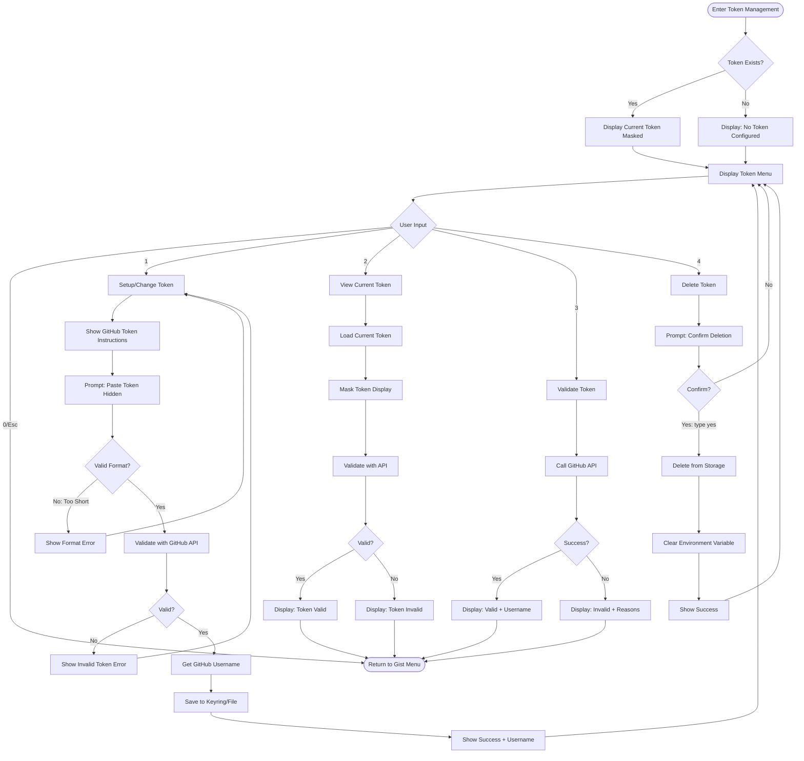

# TERA Screen Flow Charts

## Application Overview


---

## 1. Main Menu Screen


**State:**
- `stations []Station` - Quick favorites (My-favorites.json)
- `menuItems []MenuItem` - Dynamic menu with favorites
- `config *Config` - App configuration

**Actions:**
- Load quick favorites on init
- Build dynamic menu items
- Handle numeric shortcuts
- Navigate to selected screen

---

## 2. Play Screen


**State:**
- `lists []string` - Available favorite lists
- `selectedList string` - Currently selected list
- `stations []Station` - Stations in selected list
- `filterText string` - Current filter
- `player *MPVPlayer` - Player instance

**Key Logic:**
- Stations displayed alphabetically (case-insensitive)
- Filter updates list in real-time
- Check for duplicates by StationUUID before adding

---

## 3. Search Menu Screen


**State:**
- `searchType SearchType` - Tag, Name, Language, Country, State, Advanced
- `query string` - User's search query
- `loading bool` - API call in progress

**Actions:**
- POST to Radio Browser API
- Handle navigation shortcuts (0, 00)
- Display spinner during search
- Navigate to results on success

---

## 4. Search Results Screen


**State:**
- `results []Station` - Search results from API
- `filteredResults []Station` - After filter applied
- `selectedStation *Station` - Currently selected
- `filterText string` - Current filter

**Key Logic:**
- Check for duplicates by StationUUID
- Save prompt after playback ends
- Multiple navigation options (0, 00, Esc)

---

## 5. List Management Menu Screen


**State:**
- `lists []string` - Available lists
- `operation Operation` - Create, Delete, Edit, ShowAll
- `inputValue string` - User input

**Validation Rules:**
- List names cannot be empty
- Names must be unique
- \"My-favorites\" is protected (cannot delete/rename)
- Replace spaces with hyphens in names

---

## 6. Delete Station Screen


**State:**
- `lists []string` - Available lists
- `selectedList string` - Current list
- `stations []Station` - Stations in list
- `selectedStation *Station` - Station to delete

**Actions:**
- Find station by StationUUID
- Remove from array
- Save file atomically
- Handle empty list state

---

## 7. Lucky Screen (I Feel Lucky)


**State:**
- `station *Station` - Random station selected
- `player *MPVPlayer` - Player instance

**Logic:**
- Query API for high-vote stations
- Select random from results
- Same save prompt flow as other play screens

---

## 8. Gist Menu Screen


**State:**
- `hasToken bool` - Token configured status
- `gistCount int` - Number of saved gists
- `currentToken string` - Masked token display

---

## 9. Create Gist Screen


**State:**
- `token string` - GitHub token
- `files []FavoritesList` - Files to upload
- `gistID string` - Created gist ID
- `gistURL string` - Created gist URL

**Actions:**
- Read all JSON files from favorite path
- Build GitHub gist payload
- Save gist metadata for tracking
- Handle errors with helpful messages

---

## 10. My Gists Screen

```mermaid
flowchart TD
    Enter([Enter My Gists]) --> LoadMetadata[Load Local Gist Metadata]
    LoadMetadata --> CheckCount{Gists Available?}
    
    CheckCount -->|No| NoGists[Show: No Gists Created]
    NoGists --> Suggest[Suggest: Create First Gist]
    Suggest --> Back1([Return to Gist Menu])
    
    CheckCount -->|Yes| ShowList[Display Gist List]
    ShowList --> ListFormat[Format: Description | Created Date]
    ListFormat --> UserInput{User Input}
    
    UserInput -->|0/Esc| Back2([Return to Gist Menu])
    UserInput -->|Select Number| GetGist[Get Selected Gist]
    
    GetGist --> OpenURL[Open Gist URL in Browser]
    OpenURL --> Wait[Wait for Enter]
    Wait --> ShowList
```

**State:**
- `gists []GistMetadata` - Local gist records
- `selectedGist *GistMetadata` - User selection

**Display:**
- Index | Description | Created Date
- Up to 10 gists per page

---

## 11. Token Management Screen



**State:**
- `token string` - Current token
- `maskedToken string` - Display version
- `username string` - GitHub username
- `valid bool` - Validation status

**Security:**
- Hidden input when typing token
- Mask all displays (show first 11 + last 4)
- Store in keyring (fallback to encrypted file)
- Clear from memory after operations

---

## 12. Update Gist Screen


**State:**
- `gists []GistMetadata` - Available gists
- `selectedGist *GistMetadata` - Gist to update
- `newDescription string` - New description

**Actions:**
- PATCH request to update description only
- Update local metadata file
- Keep other gist data unchanged

---

## 13. Delete Gist Screen


**State:**
- `gists []GistMetadata` - Available gists
- `selectedGist *GistMetadata` - Gist to delete
- `confirmed bool` - User confirmation

**Safety:**
- Requires explicit \"yes\" confirmation
- Shows gist details before delete
- Removes local metadata even on API error
- Handles 404 gracefully (already deleted)

---

## 14. Recover from Gist Screen


**State:**
- `savedGists []GistMetadata` - Local gist records
- `gistURL string` - URL to recover from
- `fileCount int` - Number of files recovered

**Actions:**
- git clone to temp directory
- Find all .json files
- Move to ~/.config/tera/favorite/
- Clean up clone directory
- Show count of files recovered

---

## Error Handling Patterns

```mermaid
flowchart TD
    Error([Error Occurs]) --> Classify{Error Type}
    
    Classify -->|Network| NetworkError[Network Error Handler]`
    Classify -->|API| APIError[API Error Handler]
    Classify -->|File| FileError[File Error Handler]
    Classify -->|Player| PlayerError[Player Error Handler]
    Classify -->|Validation| ValidationError[Validation Error Handler]
    
    NetworkError --> ShowNetMsg[Display: Network Issue]
    ShowNetMsg --> NetTips[Show Connection Tips]
    NetTips --> OfferRetry{Retry Available?}
    
    APIError --> ShowAPIMsg[Display: API Error]
    ShowAPIMsg --> APITips[Show API-Specific Tips]
    APITips --> OfferRetry
    
    FileError --> ShowFileMsg[Display: File Operation Failed]
    ShowFileMsg --> FileTips[Show File Permission Tips]
    FileTips --> OfferRetry
    
    PlayerError --> ShowPlayerMsg[Display: Playback Error]
    ShowPlayerMsg --> PlayerTips[Show MPV Installation Tips]
    PlayerTips --> OfferRetry
    
    ValidationError --> ShowValMsg[Display: Validation Failed]
    ShowValMsg --> ValTips[Show Input Format Tips]
    ValTips --> ReturnToInput[Return to Input Screen]
    
    OfferRetry -->|Yes| RetryPrompt[Show Retry Option]
    OfferRetry -->|No| WaitReturn[Wait for Enter to Continue]
    
    RetryPrompt --> UserChoice{User Choice}
    UserChoice -->|Retry| RetryAction[Retry Original Action]
    UserChoice -->|Cancel| WaitReturn
    
    RetryAction --> Success{Succeeds?}
    Success -->|Yes| ContinueFlow[Continue Normal Flow]
    Success -->|No| Error
    
    WaitReturn --> PreviousScreen[Return to Previous Screen]
```

---

## State Transitions


---

## Data Flow


